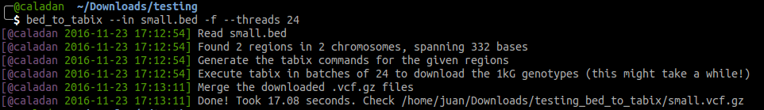

# `bed_to_tabix`

`bed_to_tabix` will download a gzipped VCF file with the 2,504 genotypes from 
The 1,000 Genomes Project in the regions defined in one or more BED files.
The utility will specifically handle: the BED sorting, the merging of many
BEDs, the **parallel-downloading** of the different chromosome variants with `tabix`
(you can even use HTTP URLs in case your FTP traffic is blocked), and it will
merge the resulting VCFs in a single gzipped VCF. Afterwards, it will perform
a cleanup of the temporary files, so you end up with a single results file.



## Requirements

- A working Internet connection.
- Python 3.5 or greater (you can get it at [Anaconda](https://www.continuum.io/downloads)).
- `tabix`, `bgzip` and `bcftools` command line utilities (>= 1.3.2). You can download all of them from [htslib.org](http://www.htslib.org/download), choosing the `htslib` and `bcftools` packages. If you have an old `tabix` version, update it because the command line interface changed from older versions.

After downloading the packages, you can install them with these commands
(replace `htslib` with `bcftools` to install the latter):

```bash
tar xvf htslib-1.3.2.tar.bz2  # Replace with the exact filename you downloaded

cd htslib-1.3.2

./configure

make

sudo make install
```

Check they were correctly installed and that you have a version >= 1.3.2:

```bash
tabix -h

bgzip -h

bcftools -h
```

## How to Install `bed_to_tabix`

You need `git` for this. In case you don't have it, `sudo apt-get install git` will work on Ubuntu.

```bash
git clone https://github.com/biocodices/bed_to_tabix
cd bed_to_tabix
python setup.py install
```

## Usage

I'm not sure if there's any risk of getting banned if you perform too many
parallel downloads from 1kG servers, so experiment with `--threads` at your own
risk.

```bash
# Download the regions in regions1.bed to regions1.vcf.gz
bed_to_tabix --in regions1.bed

# Download the regions in regions1.bed, 10 downloads at a time, to 1kg.vcf
bed_to_tabix --in regions1.bed --threads 10 --unzipped --out 1kg

# Download the regions in both bed files to regions1__regions2.vcf.gz
bed_to_tabix --in regions1.bed --in regions2.bed
```

You will get a [gzipped] VCF file with the 1kG variants found in your regions.

In case you can't connect to port 21 (FTP) --I know this is usual in some
University networks--, you can use the HTTP URLs from 1000 Genomes:

```bash
# Download from the HTTP URLs in case your traffic to FTP is blocked
bed_to_tabix --in regions1.bed --http
```

## For devs

Contributions are welcome! To run the small test suite:

```bash
pytest -q bed_to_tabix/test
```
